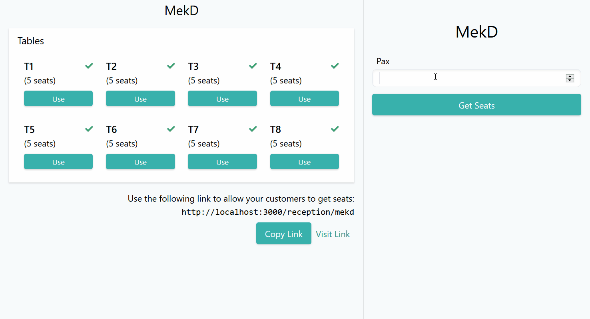

# dine-in-app

Restaurant seating management system.

Backend service is hosted in [dine-in](https://github.com/malcolm-kee/dine-in) repository.

## Demo

Registration of restaurant

<div style="max-width:600px; margin: 0 auto;">


</div>

Seat management in action



## Get Started

1. Install all dependencies

   ```bash
   yarn install
   ```

2. Start the development server

   ```bash
   yarn start
   ```

> Note that the application requires `dine-in` services to be available as specified in the [`.env`](.env) file. If the endpoints is different, add a `.env.local` file and overwrite the values.

## Testing

Run the tests and generate code coverage reports with:

```bash
yarn test:coverage
```

## Built With

- React
- Create React App
- TypeScript
- TailwindCSS
